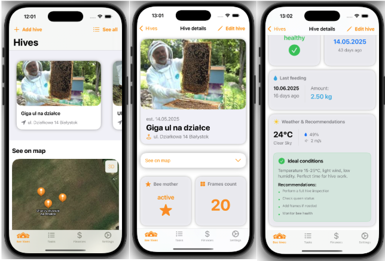
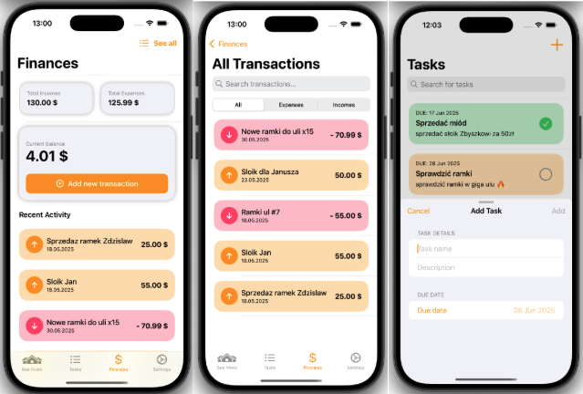

# Beekeeper App

A mobile application for beekeepers that allows efficient hives management by enabling users to add and edit hives, monitor their condition, track income, expenses and plan activities.

## Key Features

- Add, edit, and remove hives
- Monitor hive health and status
- Get recommendations for your actions based on the current weather conditions
- Track income and expenses
- Plan your beekeeping activities
- User-friendly interface designed for mobile devices

Stay organized and make your beekeeping more efficient with Beekeeper App!

## Technologies Used

**Frameworks:**  

- **SwiftUI** for building a modern, responsive user interface.
- **Core Location** for location-based features.
- **PhotosUI** for seamless photo integration.
- **MapKit** for displaying and interacting with Apple Maps.

**Backend & Cloud Services:**  

- **Firebase Authentication** for secure user sign-in and registration with e-mail and Google account.
- **Firebase Firestore** - real-time noSQL document database
- **Firebase Storage** for storing and managing photos.

**Architecture & Techniques:**

- **MVVM (Model-View-ViewModel):** Applied to separate concerns, improve code maintainability, and manage the flow of data between the UI and the app’s business logic.
- **Async/Await:** Used for handling asynchronous code in a cleaner and more readable way, especially for network requests and data fetching.
- **Dependency Injection:** Utilized to provide components with their dependencies from the outside, making the codebase more modular, testable, and easier to maintain.

## Gallery

